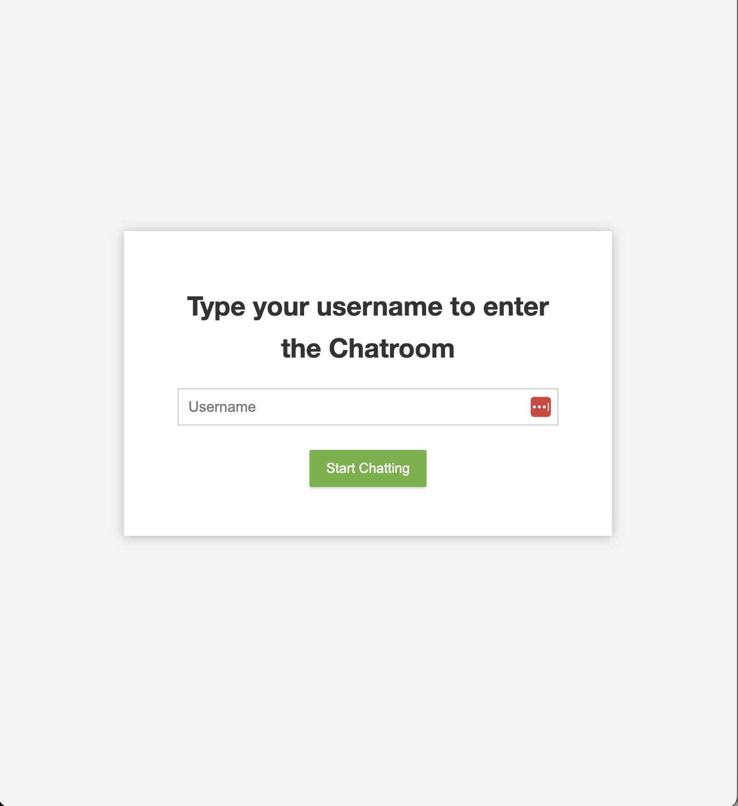
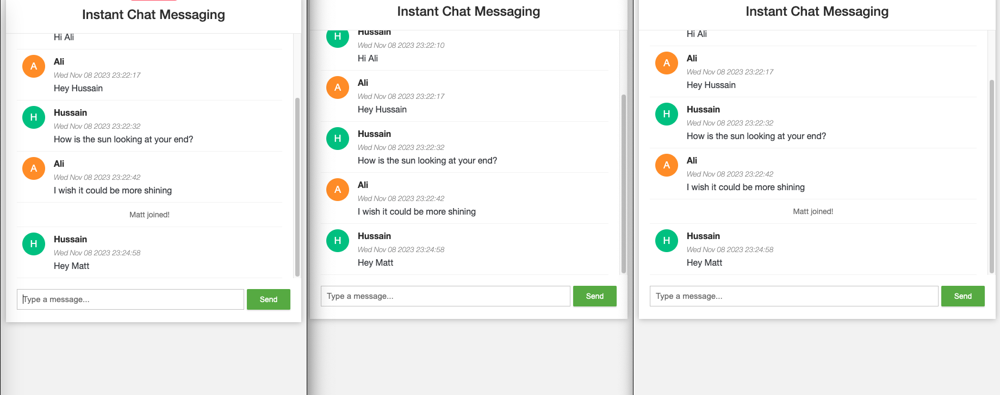
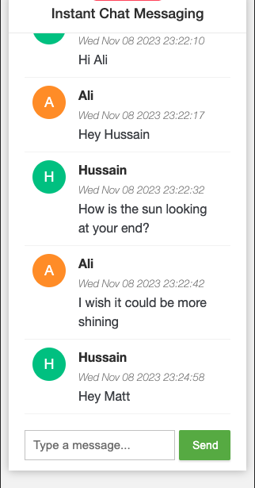

# Usage:

docker-compose up

# How it Looks

## Sign In for Chat

## Chat Main Window

## Mobile Responsive view

# Requirements Clarification:

1. Receive new messages from clients:
   - Multiple clients can send messages to a single chat group. (Done)
   - New clients should subscribe to the chat group. (Done)
   - Incoming messages should be appended to the group chat messages array in chronological order. (Done)

2. List all messages in chronological order for the client:
   - When clients subscribe, they should receive the entire message history from the chat group. (Done)
   - Optionally, implement pagination for lazy fetching of messages to a client's local collection using scrolling or clicking for efficient message retrieval. (ToDo)

# Design Considerations:

## Communication:

- HTTP: Traditional REST API for communication.
- Websockets: Real-time messaging using websockets. (Selected for better suitability of realtime use case)
- Server Side Events (WebFlux): Utilize Server-Sent Events (SSE) in WebFlux for real-time updates.

# Plan:

## Frontend:

1. Start with a basic server-side served HTML to lay the foundation. (Done)
2. Create a React app with the following components: (Partial)
   - Login/Register Page (ToDo)
   - Main Chat Page (Done)

## Backend:

1. Create a Spring Boot application and set up a websocket infrastructure without a persistence layer initially. (Done)
2. Add persistence layers using  Redis to store chat history for new users. (Done)

# Containerize:

1. Bundle the React app and serve it using a server (e.g., Node.js). (ToDo)
2. Integrate the selected database (Redis). (Done)
3. Optionally, include an Nginx container for load balancing and reverse proxying.(ToDo)

# API Design:

## WS /app/chatroom/public:

- Clarify that this is a WebSocket endpoint for public chat messages. On connection user also gets history saved

## STOMP /app/chat.addUser:

- Describe the purpose of this STOMP endpoint for adding a user to the chat.
- Include the sender's username and type ('JOIN') in the payload.

## STOMP /app/chat.sendMessage:

- Explain the functionality of this STOMP endpoint for sending chat messages.
- Include sender's username, message content, and type ('CHAT') in the payload.

# Data Payload:

- Define the expected data payload, including username (required) and email (optional).

# High-Level Design:

- Consider adding images or diagrams to illustrate the high-level architecture of your chat application.

# User Stories:

- Elaborate on user stories, such as:
   - How the first user creates a chat group. (Done)
   - How the last user closes or destroys the chat group. (Done)
   - How subsequent users join the existing group. (Done)
   - Optionally, describe rejoining with the same session. (ToDo)

# User Session Options:

- Detail user session options, including creating a fingerprint with the browser, and providing login/register functionality. (ToDo)

## Responsiveness:

- Discuss how the application will be designed to be responsive, supporting both mobile and web devices, potentially using the Tailwind CSS framework.
- For now simple css and media queries has enabled the reposnsiveness

